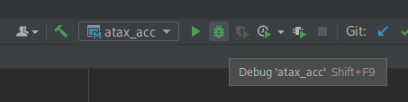
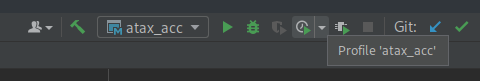

# Come riprodurre i risultati

Perchè tutto il team possa collaborare al progetto, è importante che tutti sappiano come abbiamo fatto a ottenere un certo risultato.

## Come compilare

Per compilare il codice a noi assegnato, è necessario:

1. Accedere alla cartella in cui è contenuto:
   ```console
   $ cd ./OpenMP/linear-algebra/kernels/atax
   ```

2. Eseguire il Makefile:
   ```console
   $ make clean all
   ```

## Come debuggare e profilare

Ho configurato [CLion](https://www.jetbrains.com/clion/) con le istruzioni necessarie al debug e il profiling del programma.

> (Essendo studenti dell'Unimore, abbiamo diritto a una licenza gratuita, che potete ottenere attraverso il [GitHub Student Pack](https://education.github.com/pack).)

### Debug

Per effettuare il debug del codice, è necessario selezionare la runConfiguration `atax_acc` e cliccare il pulsante "Debug" con l'insetto verde:



### Profiling locale

Per effettuare il profiling del codice, è necessario selezionare la runConfiguration `atax_acc` e cliccare il pulsante "Profile" con l'orologio e il play verde:



Di default, CLion è configurato per usare `perf` per profilare: è quindi necessario che sia installato e configurato sul vostro sistema!

### Profiling remoto

Per effettuare il profiling remoto, è necessario:

1. Accedere ad un Nano fornito da Unimore:
   ```console
   $ # Per istruzioni complete, usa le informazioni fornite nelle dispense o nella chat Matrix del corso!
   $ ssh hpc-nano9
   ```
   
2. Clonare o aggiornare questo repository:
   
   *  Clonare il repository da zero:
      ```console
      $ git clone https://github.com/Steffo99/unimore-hpc-1.git
      $ cd ./unimore-hpc-1
      ```
      
   *  Aggiornare un repository già esistente:
      ```console
      $ cd ./unimore-hpc-1
      $ git pull
      ```

3. Accedere alla cartella in cui è contenuta l'applicazione assegnata:
   ```console
   $ cd ./OpenMP/linear-algebra/kernels/atax
   ```

4. Eseguire il Makefile:
   ```console
   $ make clean all
   ```

5. Abilitare `perf`:
   ```console
   $ module load perf/1.0
   ```
   
6. <!-- TODO -->
